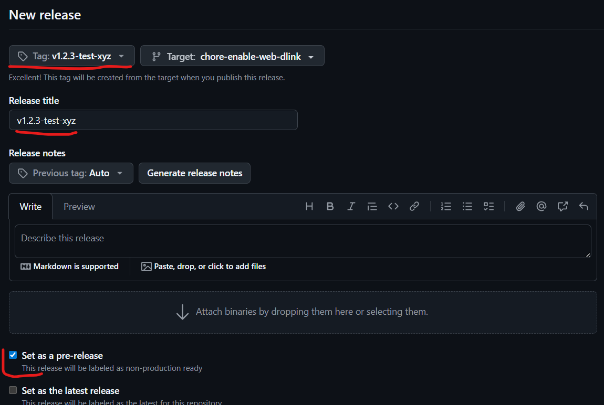

# Contributing

## Installation

- Clone the source code of [godot](https://github.com/godotengine/godot):
    - `git clone git@github.com:godotengine/godot.git` or
    - `git clone https://github.com/godotengine/godot.git`
- This branch uses version `4.5` so checkout the version with: `git checkout 4.5`
- Clone this module and put it into `godot/modules/GodotJS`:
    - `git clone git@github.com:godotjs/GodotJS.git godot/modules/GodotJS` or
    - `git clone https://github.com/godotjs/GodotJS.git godot/modules/GodotJS`
- [Recompile the godot engine](https://docs.godotengine.org/en/4.4/development/compiling/index.html)
    - Windows: `scons platform=windows`
    - MacOS: `scons platform=macos arch=arm64`

### Hints

- To enable unit tests you need to add `tests=true` to `scons` arguments
- To debug C++ code in [CLion](https://docs.godotengine.org/en/4.4/contributing/development/configuring_an_ide/clion.html#importing-the-project) you might need to add `compiledb=yes` to `scons` arguments once

## Project Structure

```
┗━ godot
    ┗━ modules
        ┣━ ...
        ┣━ gltf
        ┣━ GodotJS
        ┃    ┣━ bridge
        ┃    ┣━ compat
        ┃    ┣━ docs
        ┃    ┣━ impl
        ┃    ┣━ internal
        ┃    ┣━ lws
        ┃    ┣━ quickjs
        ┃    ┣━ quickjs-ng
        ┃    ┣━ scripts
        ┃    ┣━ tests
        ┃    ┣━ v8
        ┃    ┃   ┣━ include
        ┃    ┃   ┣━ linux.x86_64.release
        ┃    ┃   ┣━ macos.arm64.release
        ┃    ┃   ┣━ windows_x86_64_release
        ┃    ┃   ┗━ ...
        ┃    ┣━ weaver
        ┃    ┗━ weaver-editor
        ┣━ gridmap
        ┣━ ...
```

## Preparing your PR

Before submitting your PR add a [Changeset](https://github.com/changesets/changesets) entry:

- From the root, run `pnpm run changeset` and follow the CLI instructions
- You can add a full description of your change in Markdown format

## Pre-release as maintainer

If you want to create a pre-release to test build targets you need to [draft a new release](https://github.com/godotjs/GodotJS/releases/new):

- Create a new tag like `v1.2.3-test-xyz` and use the same name for the release title.
- Next you can select a target branch - you don't have to pick `main`.
- Make sure to check the `Set as a pre-release` checkbox.
- Release notes are optional


