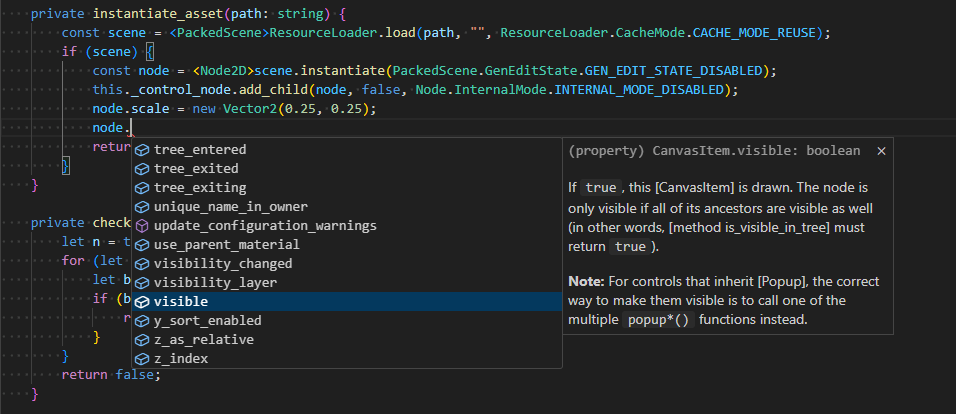
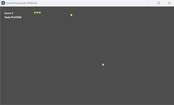
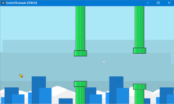

# GodotJS 
This project adds TypeScript/JavaScript Support for Godot 4.x by leveraging the high-performance capabilities of V8 to bring the delightful development experience of TypeScript into Godot.  

[](https://github.com/ialex32x/GodotJS-Build/actions/workflows/build_editor_windows.yml)
[](https://github.com/ialex32x/GodotJS-Build/actions/workflows/build_editor_macos.yml)
[](https://github.com/ialex32x/GodotJS-Build/actions/workflows/build_editor_linux.yml)

> [!NOTE]
> The core functionality is implemented and essentially usable but still under testing.  



## Features
* [x] Godot ScriptLanguage integration
* [x] Debug with Chrome devtools when using V8
* [x] REPL in Editor
* [x] Hot-reloading
* [x] QuickJS as an alternative runtime (experimental, testing)
* [ ] Asynchronous module loading (`import` function)
* [ ] Sandboxed scripting (not multi-threading)
* [ ] Worker threads

## Get Started

### Option 1: v8

**STEP 1:** Download or clone the repo into the `modules` directory of your Godot engine source:
```sh
cd YourGodotEngineSource/modules
git clone https://github.com/ialex32x/GodotJS.git
```

**STEP 2:** Put `v8` headers and libraries into `GodotJS`, or directly download the prebuilt `v8` from [GodotJS-Dependencies](https://github.com/ialex32x/GodotJS-Dependencies/releases):

```sh
# download the archive of prebuilt v8 
curl https://github.com/ialex32x/GodotJS-Dependencies/releases/download/v8_r11/v8_r11.zip --output your/download/path/v8.zip

# extract the zip file into your `GodotJS` directory, 
# NOTE: no white space after the switch `-o`
7z x -o"YourGodotEngineSource/modules/GodotJS" your/download/path/v8.zip 
```
> [!NOTE]
> Don't forget to put the headers/libraries of `v8` into the same directory structure used in prebuilt `v8` if you decide to compile it by yourself.

The module directroy structure looks like this:
```
┗━ godot
    ┗━ modules
        ┣━ ...
        ┣━ gltf
        ┣━ GodotJS
        ┃    ┣━ bridge-quickjs
        ┃    ┣━ bridge-v8
        ┃    ┣━ ...
        ┃    ┣━ lws
        ┃    ┗━ v8
        ┃        ┣━ include
        ┃        ┣━ linux.x86_64.release
        ┃        ┣━ macos.arm64.release
        ┃        ┣━ windows_x86_64_release
        ┃        ┗━ ...
        ┣━ gridmap
        ┣━ ...
```

The currently used version of `v8` is `12.4.254.20`.

**STEP 3:** Compile and launch `Godot Editor`. Then, [install TypeScript/JavaScript presets](./docs/install_ts_presets.md) into a Godot project.

> [!NOTE]
> Since the prebuilt `v8` library is built with the `windows-latest` github runner which uses VS2022, encountering `Unresolved external symbol` errors during linkage with `v8_monolith.lib` or `libucrt.lib` may be addressed by updating to the latest version of the `MSVC v143` toolchain, `Windows Universal CRT SDK` and `Visual Studio 2022` itself. See [GodotJS-Dependencies README](https://github.com/ialex32x/GodotJS-Dependencies) for the version of MSVC C++ Compiler used in different prebuilt library packages.

A prebuilt version of `Godot Editor` can be downloaded from [GodotJS-Build](https://github.com/ialex32x/GodotJS-Build/releases).  
**Because the GodotJS-Build workflow is currently run manually, it may not be built from the latest commit of `GodotJS`.**

### Option 2: QuickJS
> [!NOTE] 
> QuickJS support may not be stable enough to use.

To enable `QuickJS`, please run scons with the parameter `use_quickjs=yes`.

```sh
# An example on Windows:
scons vsproj=yes dev_build=yes p=windows use_quickjs=yes 
```

## Examples 

For more information on how to use `GodotJS` in a project, check out [GodotJSExample](https://github.com/ialex32x/GodotJSExample.git) for examples written in typescript.  
**And, don't forget to run `npm install` and `npx tsc` before opening the example project.**

[](https://github.com/ialex32x/GodotJSExample.git)
[](https://github.com/ialex32x/GodotJSExample.git)

## More Details

### Scripting
* [GodotJS Scripts](./docs/godotjs_scripts.md)
* [Godot Bindings](./docs/godot_binding.md)
* [Running code in the editor](./docs/running_code_in_editor.md)
* [Signals](./docs/signals.md)

### Utilities
* [REPL](./docs/repl.md)
* [SourceMap](./docs/source_map.md)
* [Debugger](./docs/debugger.md)

### Advanced
* [Build V8](./docs/build_v8.md)
* [QuickJS](./docs/quickjs.md)
* [Dependencies](./docs/deps.md)
* [Compiler Options](./docs/compiler_options.md)
* [Unit Testing](./docs/unit_testing.md)
* [Misc](./docs/misc.md)

## Auxiliary Repositories
* [GodotJSExample](https://github.com/ialex32x/GodotJSExample): An example godot project for demonstrating how to use GodotJS
* [GodotJS-Build](https://github.com/ialex32x/GodotJS-Build): Github workflows for building Godot Editor with GodotJS support
* [GodotJS-Dependencies](https://github.com/ialex32x/GodotJS-Dependencies): Github workflows for building dependencies of GodotJS (v8, lws)

## Supported Platforms

|                | v8.impl        | quickjs.impl   | quickjs.impl (quickjs-ng) | web.impl   |
| -------------- | -------------- | -------------- | ------------------------- | ---------- |
| Windows:x86_64 | ✅              | ✅              | 🟡 (incomplete)                | ❌        |
| Windows:arm64  | 🟡 (incomplete)     | 🟡 (incomplete)     | 🟡 (incomplete)                | ❌        |
| MacOS:x86_64   | ✅ (not tested) | ✅ (not tested) | 🟡 (incomplete)                | ❌        |
| MacOS:arm64    | ✅              | ✅              | 🟡 (incomplete)                | ❌        |
| Linux:x86_64   | ✅ (not tested) | ✅ (not tested) | 🟡 (incomplete)                | ❌        |
| Linux:arm64    | 🟡 (incomplete)     | 🟡 (incomplete)     | 🟡 (incomplete)                | ❌        |
| Android:x86_64 | ✅ (not tested) | ✅ (not tested) | 🟡 (incomplete)                | ❌        |
| Android:arm64  | ✅              | ✅ (not tested) | 🟡 (incomplete)                | ❌        |
| iOS:x86_64     | ✅ (not tested) | ✅ (not tested) | 🟡 (incomplete)                | ❌        |
| iOS:arm64      | ✅ (not tested) | ✅ (not tested) | 🟡 (incomplete)                | ❌        |
| Web            | ❌            | 🟡 (incomplete)     | 🟡 (incomplete)                | 🟡 (incomplete) |


> Android: tested on ndk_platform=android-24  
> Currently, except for the web, 32-bit platforms are not considered to support. 
