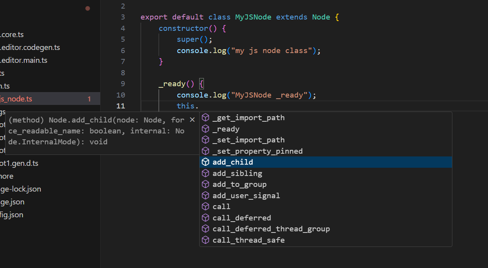

JavaScript for Godot with V8

> **NOTE** This project is still in the very early stage of development.

## Features
* [x] Support on-demand binding
* [x] Essential NodeJS compatibilities (`console` , `timers` and `CommonJS` modules)
* [ ] Support REPL in Godot Editor
* [ ] Asynchronous module loading support (`import` function)
* [x] Godot Object types binding
* [ ] Godot Primitive types binding
* [ ] Godot `ScriptLanguage` integrating
* [ ] Multiple contexts for sandboxing script environments (not multi-threading)
* [ ] Support hot-reload
* [ ] Worker threads implementation
* [ ] Seamlessly switch to QuickJS when targeting web platform
* [x] Debug with Chrome devtools when using V8
* [x] Support SourceMap

## Get Started

Download or clone the repo into Godot `modules` directory:
```sh
cd YourGodotEngineSource/modules
git lfs clone https://github.com/ialex32x/jsb.git
```

Compile and launch `Godot Editor`.

Install TS project presets with `Godot Editor` menu item `Project > Tools > GodotJS > Install TS Project`.
> All `jsb` premade config/scripts will be generated at `res://typescripts` and `res://javascripts` (the location will be configurable in a future version).
> `d.ts` files of godot classes will also be generated at the same time.

> **NOTE** The directory `typescripts` is automatically ignored in `Godot Editor`. Edit typescript source from the `typescripts` directory with any code editor (like VSCode).

Since the `d.ts` files for godot classes are generated in the TS project, `IntelliSense` works perfectly in VSCode for better coding efficiency.



Install javascript packages:
```sh
cd YourGodotProject/typescripts
npm i
```

Write and compile your typescript source:
```sh
cd YourGodotProject/typescripts
# remove the option `-w` if no continuous compilation required
npx tsc -w
```

## GodotJS Scripts
A javascript class can extend a Godot Object class (like GDScript):

> This example is written in TypeScript.

```ts
import { Node } from "godot";

export default class MyJSNode extends Node {
    constructor() {
        super();
        console.log("my js node class");
    }

    _ready() {
        console.log("MyJSNode _ready");
    }

}
```

Attach the compiled file to a Node:


## Debugger

A debugger bridge is implemented. 
Open `devtools://devtools/bundled/inspector.html?experiments=true&v8only=true&ws=127.0.0.1:9229/1` in `Chrome` to start debugging the javascript sources.

> **NOTE** The listening port can be changed in `Project Settings > jsb > Debugger > Port`. A restart is required for it to take effect.


## Current State

| Platform | V8 | QuickJS |
| --- | --- | --- |
| Windows x86_64 | WIP | TODO |
| Windows x86_32 | UNPLANNED | UNPLANNED |
| UWP | UNPLANNED | UNPLANNED |
| Windows ARM64 | TODO | TODO |
| Linux x86_64 | TODO | TODO |
| Linux ARM64 | WIP | TODO |
| MacOS x86_64 | TODO | TODO |
| MacOS ARM64 | WIP | TODO |
| WebAssembly | X | TODO |


| Runtime | Version |
| --- | --- |
| v8 | 12.4 |
| quickjs | 2024-01-13 |
| godot | 4.2 |
| libwebsockets | 4.3.3-13-g6901c32a |
