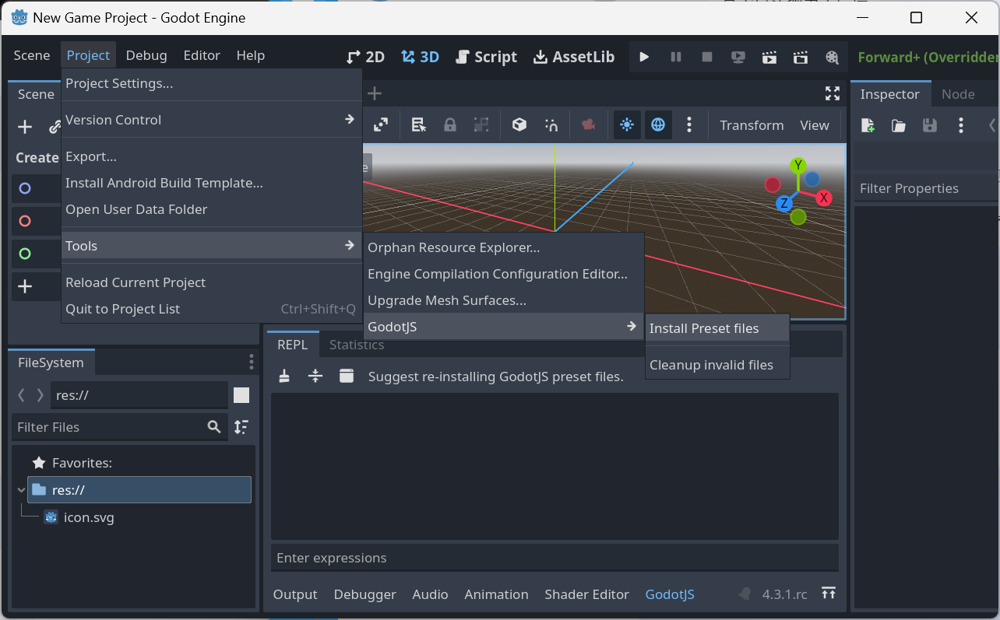
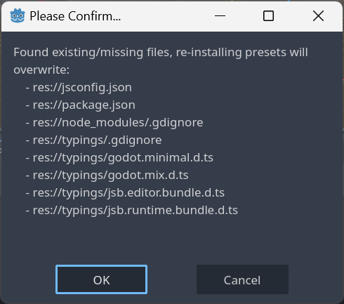
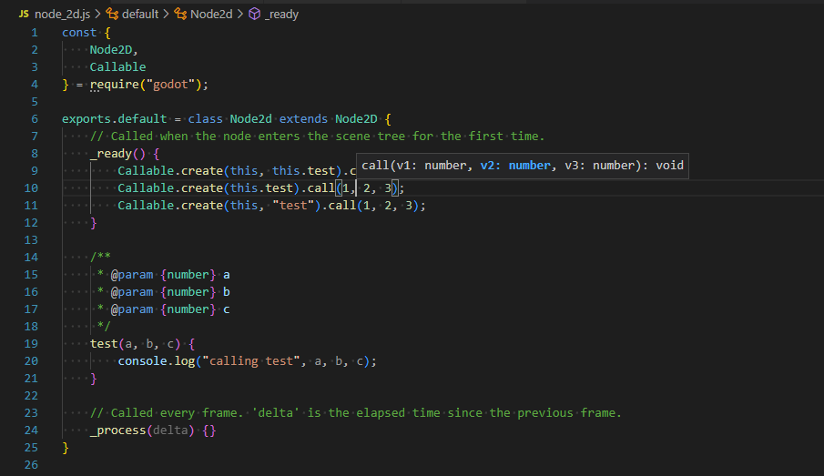

# Create a JavaScript Project from Scratch

## Build *GodotJS*
The build option `use_typescript=no` is needed to let *GodotJS* know JavaScript is the prefered script language you want to use.

## Install preset files
After creating an empty godot project, it's strongly recommended to install GodotJS presets before any others `Project > Tools > GodotJS > Install Preset files`.

Click `OK` to confirm a list of files will be generated in the project.

> [!NOTE] 
> The generated files improve the coding experience a lot, which make you code in javascript with complete type hints.

## Create scripts

Open the project folder in *VSCode*, let's rock!

> [!NOTE]
> All types from `godot` are strongly typed in *VSCode* since the editor automatically detects types from all generated `.d.ts`. 
> But you need to write additional type annotations for your custom types in the way demonstrated above. See also [jsdoc](https://jsdoc.app/about-getting-started)
