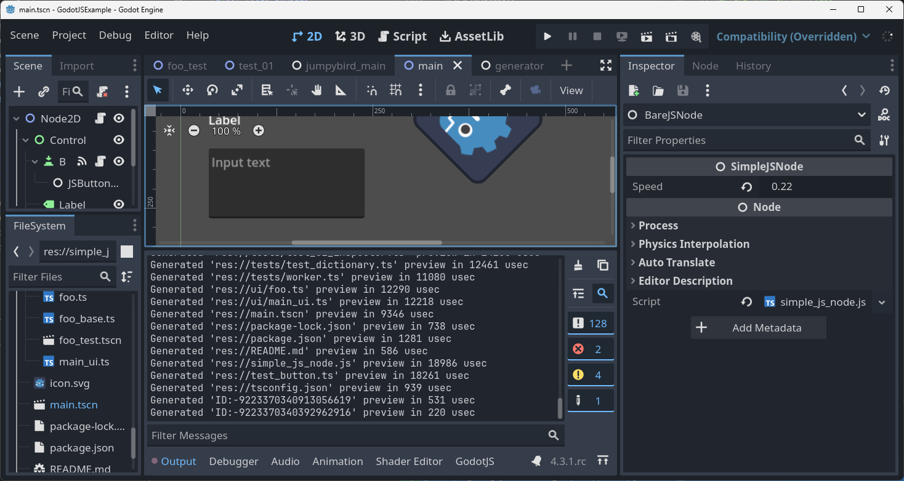

# Create a TypeScript Project from Scratch

## Build *GodotJS*
By default, *GodotJS* uses TypeScript as the prefered script language. `use_typescript=yes` can be omitted when building from source.

## Install Preset Files
After creating an empty godot project, it's strongly recommended to install GodotJS presets before any others `Project > Tools > GodotJS > Install Preset files`.


Click `OK` to confirm a list of files will be generated in the project.


## Create Scripts


Open the project folder in *VSCode*, let's rock!


## Compile TypeScript Sources

Before your scripts runnable in *Godot*, run `tsc` to compile typescript sources into javascript.

```sh
npx tsc

# or watch if you want
npx tsc -w
```

Also, you can simply click the tool button on *GodotJS* bottom panel in the godot editor. It'll do the same thing for you.


## Use JavaScript in a TypeScript Project

It's still possible to write JavaScript in a TypeScript project:
* Write JS code in `.ts` (it's typescript 😄)
* Write JS code in `.js`, you need to create it directly in the external code editor, instead of creating in godot editor.

> [!WARNING]
> It's not recommened to define a godot script class in `.js` in a TypeScript project. It may not work in the future versions. 
> Oppositely, it just behaves like code from `node_modules` if the JS code is used as ordinary JavaScript.

```js
"use strict";

// CommonJS is the only supported module system for now.
// `tsc` will handle these stuff for you if you are using TypeScript.
// In manually written javascript source, use `require` to import modules.

const { Node, Variant } = require('godot');
const annotations = require("godot.annotations");

// declare your script class
// DO NOT FORGET TO EXPORT YOUR SCRIPT CLASS AS DEFAULT
exports.default = class SimpleJSNode extends Node {
    speed = 0;

    _ready() {
        console.log("SimpleJSNode _ready");
    }
}

// export a property to Godot 
annotations.export_(Variant.Type.TYPE_FLOAT)(SimpleJSNode.prototype, "speed");

```



