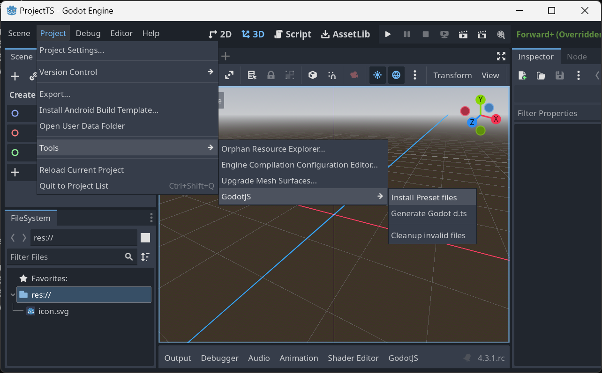
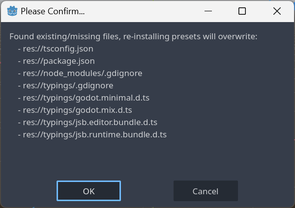
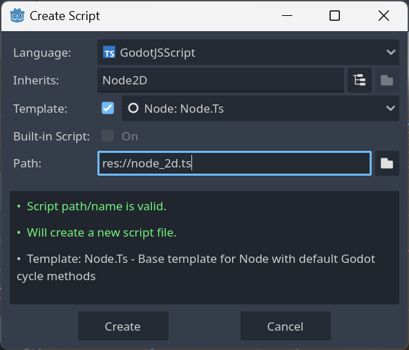
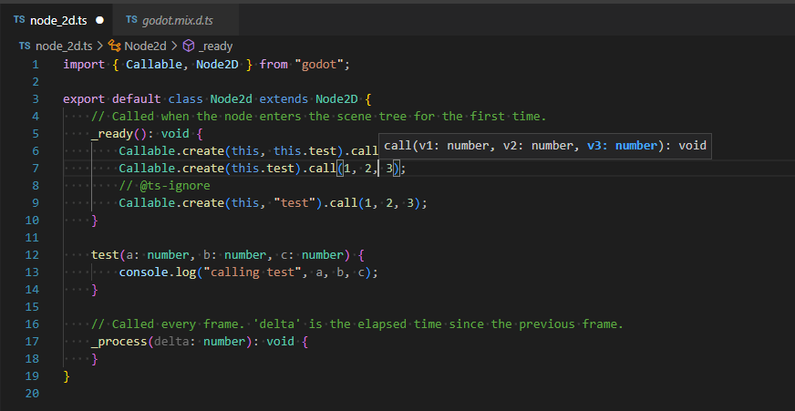
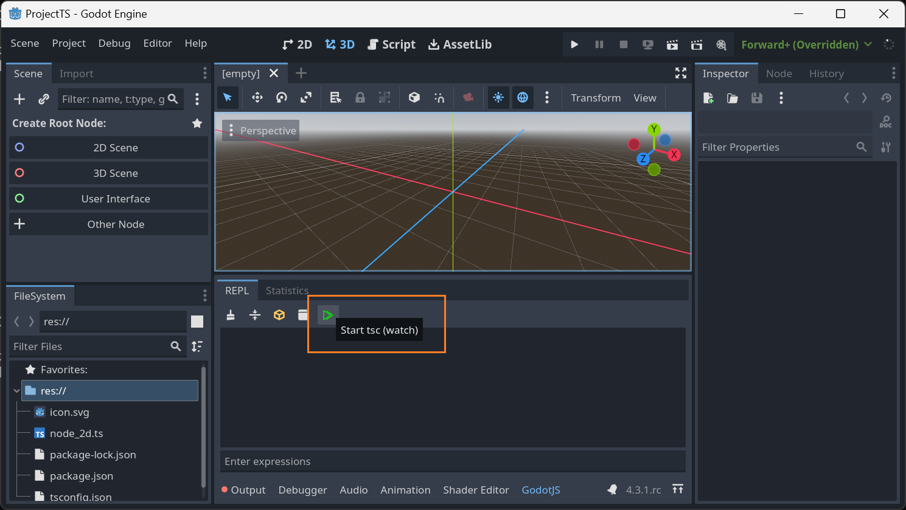

# Create a TypeScript Project from Scratch

## Build *GodotJS*
By default, *GodotJS* uses TypeScript as the prefered script language. `use_typescript=yes` can be omitted when building from source.

## Install Preset Files
After creating an empty godot project, it's strongly recommended to install GodotJS presets before any others `Project > Tools > GodotJS > Install Preset files`.



Click `OK` to confirm a list of files will be generated in the project.


## Create Scripts



Open the project folder in *VSCode*, let's rock!



## Compile TypeScript Sources

Before your scripts runnable in *Godot*, run `tsc` to compile typescript sources into javascript.

```sh
npx tsc

# or watch if you want
npx tsc -w
```

Also, you can simply click the tool button on *GodotJS* bottom panel in the godot editor. It'll do the same thing for you.


