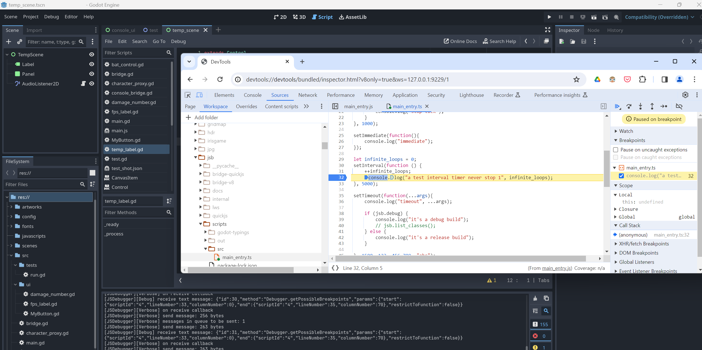

## Debugger

A debugger bridge is implemented.
Open `devtools://devtools/bundled/inspector.html?experiments=true&v8only=true&ws=127.0.0.1:9229/1` in `Chrome` to start debugging the javascript sources.

> [!NOTE] 
> The listening port can be changed in `Project Settings`, and a restart is required for it to take effect.  
> `Project Settings > GodotJS > Debugger > Editor Port` for `Editor` environment  
> `Project Settings > GodotJS > Debugger > Runtime Port` for `Runtime` environment.
> Check `Advanced Settings` if they are not listed in `Project Settings`.

