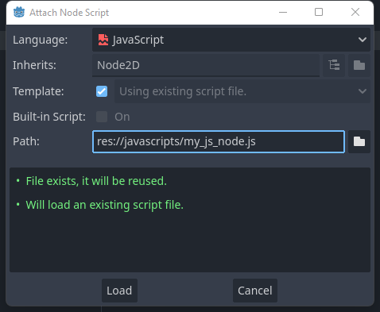
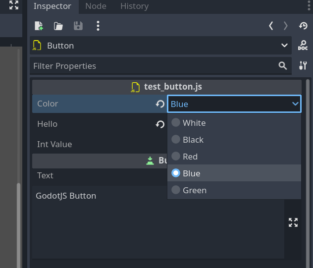
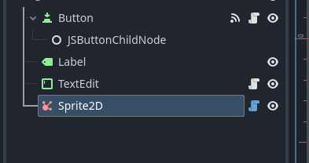
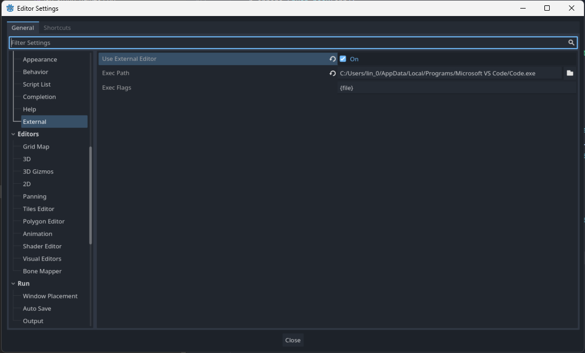

# GodotJS Scripts
A javascript class can extend a Godot Object class:

> This example is written in TypeScript.

```ts
import { Node, Signal } from "godot";
import { signal } from "./jsb/jsb.core";

export default class MyJSNode extends Node {
    @signal()
    test!: Signal;

    private _on_test() {

    }

    _ready() {
        console.log("MyJSNode _ready");

        this.test.connect(jsb.callable(this, this._on_test), 0);
        this.test.emit();
        this.test.disconnect(jsb.callable(this, this._on_test));
    }

}
```

> [!WARNING]
> Explicitly defined `constructor` in script classes inherited from Godot Object are not recommended, because GodotJS constructs the script classes for special uses (such as CDO and cross-binding).  
> If it can't be avoided, always define it with an explicit argument `identifier? any`, and don't forget to call `super(identifier)`.

For instance:
```ts
export default class MyExampleNode extends Node {
    constructor(identifier?: any) {
        super(identifier);

        // do other things you want
        //...
    }
}
```

You can instantiate a script class directly with `new` in scripts:
```ts
// do not pass any arguments to the constructor
let node = new MyExampleNode();
```

> [!NOTE]
> A class must be exported as `default`, otherwise the script will not recognized as a valid script class.

Compile the typescript source into javascript, and attach the compiled script to a Node:



## Exported Properties
In `GodotJS`, class member properties/variables can be exported. This means their value gets saved along with the resource (such as the scene) they're attached to. They will also be available for editing in the property editor. Exporting is done by using the `@export_` annotation.

```ts
export default class Shooter extends Sprite2D {
    // type must be explicitly provided as the first parameter of @export_
    // cuz static type is actually a phantom in typescript
    @export_(Variant.Type.TYPE_FLOAT)
    speed: number = 0;

    // ...
}
```

In this example the value `0` will be saved and visible in the property editor.  

The retrieval of default value is implemented through `Class Default Object (CDO)`. `GodotJS` will instantiate a pure javascript instance of the script class (`Shooter` in this example) as `CDO`, then the property value is read from `CDO` as `default value` in the property editor. 

> [!NOTE] 
> Be cautious when coding within `constructor`, as it is probably called for initializing `CDO`.

### Basic Use

```ts 
@export_(Variant.Type.TYPE_STRING)
address: string = "somewhere";

@export_(Variant.Type.TYPE_INT)
age: number = 0;
```

If there's no default value, `default value` of the give type will be used (`0` in this case).
```ts 
@export_(Variant.Type.TYPE_INT)
age: number;
```

### Exported Enum Properties
Enum value properties can be exported with the built-in support in the property editor.

> [!NOTE]
> So far, only `int` is supported as enum value.

```ts
@export_enum(MyColor)
color: MyColor = MyColor.White;
```

The value can be easily chose from a dropdown list in the editor.  



### Grouping Exports
NOT IMPLEMENTED FOR NOW

## Signals
WRITE SOMETHING HERE

## Icon annotation

An icon can be used as node icon in the editor scene hierarchy with the annotation `@icon`.

```ts
@icon("res://icon/affiliate.svg")
export default class MySprite extends Sprite2D {
}
```



## Cyclic imports
Cyclic imports are allowed in `GodotJS` with some limits.

```ts
// file: cyclic_import_1.ts

import { CyclicClass2 } from "./cyclic_import_2";

// NOT OK: The behaviour is undefined if anything from cyclic imported modules is referenced in the script compile-run scope
// let a_name = CyclicClass2.something;

// NOT OK: extends a class from cyclic imported modules
// class BehaviorUndefined extends CyclicClass2 {}

// OK: references at runtime
export class CyclicClass1 {
    static call1() {
        console.log("call1");
        CyclicClass2.call2();
    }

    static call3() {
        console.log("call3");
    }
}
```

```ts
// file: cyclic_import_2.ts

import { CyclicClass1 } from "./cyclic_import_1";

export class CyclicClass2 {
    static call2() {
        console.log("call2");
        CyclicClass1.call3();
    }
}
```

## Reloading
WRITE SOMETHING HERE


## Use External Editor
It's recommended to use external editor to write typescripts. Change the settings in `Editor > Edtior Settings > Text Editor > Use External Editor`, and replace the `Exec Path` with the code editor installed locally:




---

[Go Back](../README.md)
