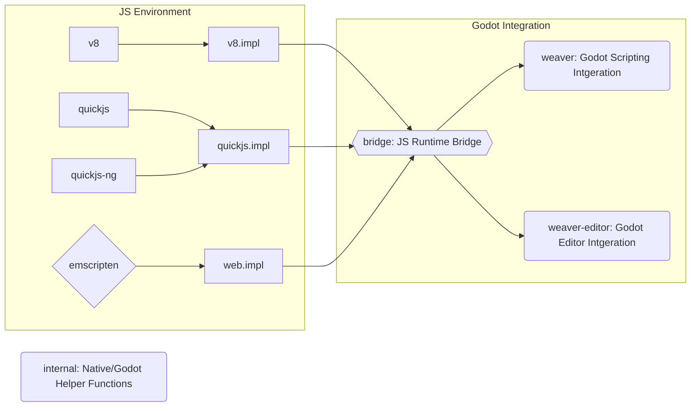

## Architecture

```mermaid
flowchart LR

subgraph JS Environment
    v8-->v8.impl
    quickjs-->quickjs.impl
    quickjs-ng-->quickjs.impl
    web{emscripten}-->web.impl
end 

v8.impl-->bridge
quickjs.impl-->bridge
web.impl-->bridge

subgraph Godot Integration
    bridge-->weaver
    bridge-->weaver-editor
end

bridge{{bridge: JS Runtime Bridge}}
internal(internal: Native/Godot Helper Functions)
weaver(weaver: Godot Scripting Intgeration)
weaver-editor(weaver-editor: Godot Editor Intgeration)

```

---

[Go Back](../README.md)
