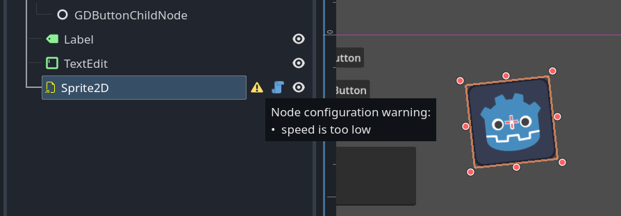

## Running code in the editor

> [!NOTE] 
> Read [Godot Docs](https://docs.godotengine.org/en/stable/tutorials/plugins/running_code_in_the_editor.html#what-is-tool) for more details about `@tool`.


If a GodotJS class is annotated with `tool()`, it'll be instantiated in the editor. Check `Engine.is_editor_hint()` in the script to check if it's running in the editor.  
It's also possible to show warnings on a `Node` on `Scene` panel with `_get_configuration_warnings` defined. Here is a simple example:

```ts
import { Engine, PackedStringArray, Sprite2D, Variant } from "godot";
import { export_, tool } from "../jsb/jsb.core";

@tool()
export default class MyEditorSprite extends Sprite2D {

    /**
     * get/set property for `export` (both must be defined)
     */
    @export_(Variant.Type.TYPE_FLOAT)
    get speed(): number { return this._speed; }
    set speed(value: number) {
        if (this._speed != value) {
            this._speed = value;
            this.update_configuration_warnings();
        }
    }

    /**
     * plain field for `export`
     */
    @export_(Variant.Type.TYPE_INT)
    unused_int = 0;

    private _clockwise = false;
    private _speed = 0;

    _ready() {
        this._clockwise = Engine.is_editor_hint();
    }

    _process(delta: number) {
        const step = Math.PI * delta * (this._clockwise ? this._speed : -this._speed);
        this.set_rotation(this.get_rotation() + step);
    }

    _get_configuration_warnings() {
        let warnings = new PackedStringArray();
        if (this._speed >= -0.01 && this._speed < 0.01) {
            warnings.append("speed is too low");
        }
        return warnings;
    }
}
```

By attaching this script on a `Sprite2D` node and setting `_speed` as `0`, a warning message will be listed on `Scene` panel if `_speed` is too small.




## Running one-off scripts using EditorScript
Sometimes, you need to run code just one time to automate a certain task that is not available in the editor out of the box. Some examples might be:

- Use as a playground for `GodotJS` scripting without having to run a project. print() output is displayed in the editor Output panel.

- Scale all light nodes in the currently edited scene, as you noticed your level ends up looking too dark or too bright after placing lights where desired.

- Replace nodes that were copy-pasted with scene instances to make them easier to modify later.

This is available in Godot by extending `EditorScript` in a script. This provides a way to run individual scripts in the editor without having to create an editor plugin.

```ts 
import { EditorScript } from "godot";
import { tool } from "../jsb/jsb.core";

@tool()
export default class MyEditorScript1 extends EditorScript {
    _run() {
        console.log("my editor script run");
    }
}
```

This `_run()` method is executed when you use `File > Run` or the keyboard shortcut `Ctrl + Shift + X` while the `EditorScript` is the currently open script in the script editor. This keyboard shortcut is only effective when currently focused on the script editor.


## Running batch scripts using editor parameters
Scripts can also be executed from command line arguments, making them very suitable for batch processing tasks, such as generating config files, converting formats, and so on.

```sh
./bin/your_godot_binary_file --path "path\to\your_project" --script res://tests/read_xlsx.ts
```

It's an example script which leverages [xlsx.js](https://www.npmjs.com/package/xlsx) for directly reading data from Excel xlsx files, re-saving it as csv or anything you want.

```ts
import * as jsb from "godot-jsb";
import { FileAccess } from "godot";

console.log("please run 'npm install' in the directory './' at first if 'xlsx' module can not be resolved");

//NOTE xlsx requires 'stream' module if 'require' exists
//     but, actually, this module is not utilized by xlsx in practice, 
//     pretending it exists helps avoid errors as a workaround.
jsb.internal.add_module("stream", {});
import * as xlsx from "xlsx";

let filename = "res://test.xlsx";
let wb = xlsx.read(jsb.to_array_buffer(FileAccess.get_file_as_bytes(filename)), { type: "buffer" });

console.log("read excel:", filename);
for (let sheetIndex in wb.SheetNames) {
    let sheetName = wb.SheetNames[sheetIndex]

    console.log(`read sheet: ${sheetName}`);
    let sheet = wb.Sheets[sheetName];
    let csv = xlsx.utils.sheet_to_csv(sheet);
    console.log("to_csv:", csv);
    let range = xlsx.utils.decode_range(sheet["!ref"]!);
    for (let row = range.s.r; row <= range.e.r; row++) {
        for (let col = range.s.c; col <= range.e.c; col++) {
            let cell = sheet[xlsx.utils.encode_cell({ c: col, r: row })];
            if (cell) {
                console.log(cell.v);
            }
        }
    }
}

```

---

[Go Back](../README.md)
