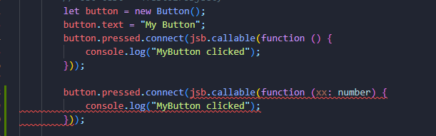

# Signals

Leveraging TypeScript's strong type checking, when you connect an incorrect callable object to a signal, the code editor will directly prompt you about the error.



## Callable

`jsb.callable` returns a `Callable` javascript object.  

> [!WARNING]
> Please be cautious that `jsb.callable(this, this.xxx) === jsb.callable(this, this.xxx)` returns `false`.   
> But it's compared internally in C++ to check equality when using them for `connect` and `disconnect`.

```ts
import { Node } from "godot";
import * as jsb from "godot-jsb";

class MyClass extends Node {
    foo() {
        // subscribe
        this.onclick.connect(jsb.callable(this, this.handle_onclick), 0);

        // unsubscribe
        this.onclick.disconnect(jsb.callable(this, this.handle_onclick));
    }
}
```

> [!NOTE]
> `jsb.callable` does not hold a strong reference on `this` which given as the first parameter. It becomes invalid after the corresponding javascript object is garbage collected.  

> [!WARNING]
> However, it may cause object leaks if `this` is captured in a lambda function. So avoid coding in this way `jsb.callable(this, () => this.xxx())`.

## Await a Signal

With a simple wrapper, `Signal` can be awaitable in javascript:

```ts
import { Node, Signal } from "godot";
import { $wait, signal } from "jsb.core";

class ExampleClass extends Node {
    @signal()
    test_signal!: Signal;

    _ready() {
        test();
    }

    async test() {
        console.log("before signal emit");
        // result is 123
        const result = await $wait(this.test_signal); 
        console.log("after signal emit", result);
    }

    emit_somehow() {
        this.test_signal.emit(123);
    }
}
```


---

[Go Back](../README.md)
