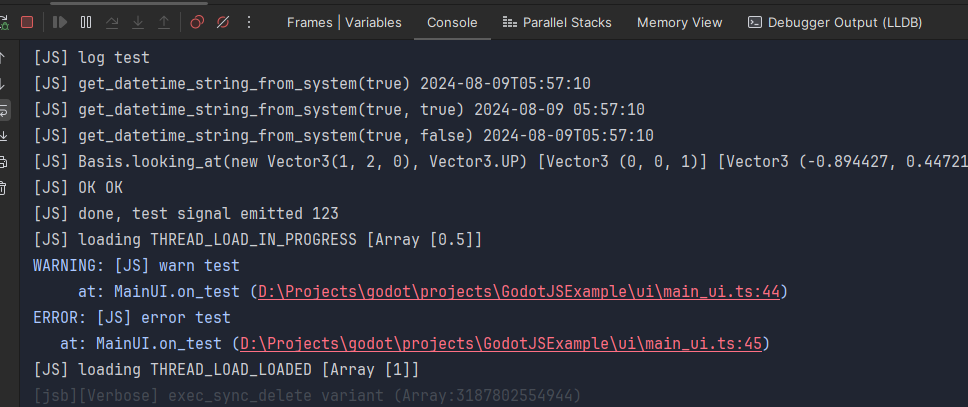

# SourceMap

[A simple parser](../internal/jsb_source_map.cpp) is implemented in `GodotJS` to translate stacktrace info from javascript source position into typescript source position.  

> [!NOTE]
> `inlineSourceMap` is not supported.

---

[Go Back](../README.md)
